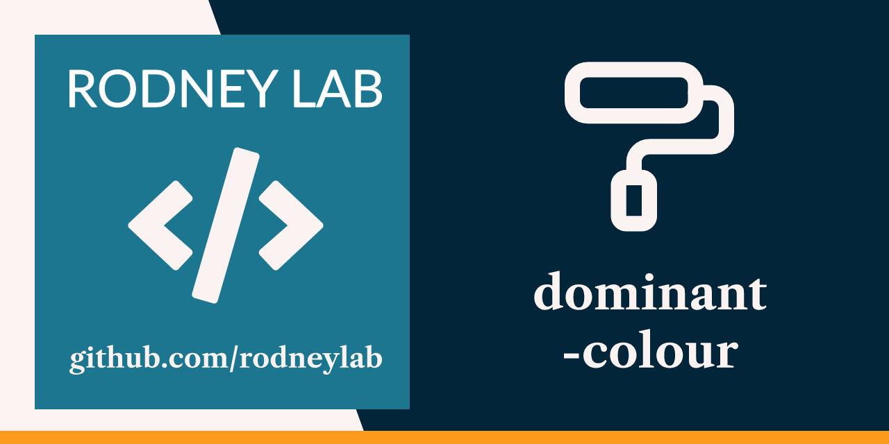

  

<h1 align="center">
  dominant-colour
</h1>

**Generate dominant colour, base64 data-URIs for use as website image placeholders**

> **Warning** 🚧 Work in progress

## License

The project is licensed under BSD 3-Clause License — see the
[LICENSE](./LICENSE) file for details.
